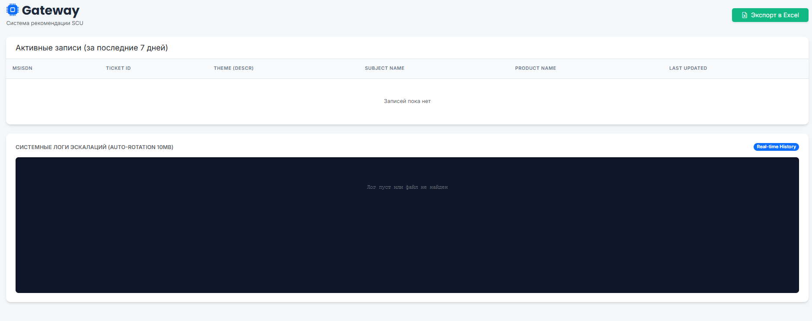

🚀 Telecom Smart L2 Gateway (Python Interceptor)
The Interceptor API is a high-performance service designed for the automated processing, filtering, and intelligent 
routing of technical support tickets. It acts as a gateway between frontend systems (e.g., PHP-based platforms) and 
backend support levels.

Key Features
Automated Triage: Identifies ticket intent (Internet vs. Voice issues) using intelligent keyword analysis.
Intelligent Autoreply: Provides instant, categorized troubleshooting instructions for new, unique inquiries.
Manual Bypass: Immediately forces manual_processing for L2-SCU if the description contains urgent triggers (e.g., "repeat request", "recommendations didn't help").
Silent Escalation: Automatically routes recurring issues (same MSISDN/Theme within a 7-day window) to L2-SCU without redundant replies.
Admin Dashboard: Web-based interface for real-time log monitoring and ticket history analysis.
Data Export: Built-in functionality to export ticket records to Excel for detailed reporting.

Technical Stack
Framework: FastAPI (Python 3.10)
ORM/Database: SQLAlchemy with SQLite
Data Processing: Pandas & OpenPyxl
Server: Uvicorn
Containerization: Docker

📂 Project Structure
telecom_logic/
├── data/                 # Database and log storage (auto-created) 
├── templates/
│   └── admin.html        # Admin dashboard UI 
├── .env                  # Environment variables 
├── Dockerfile            # Docker build instructions 
├── main.py               # Core FastAPI application logic 
├── requirements.txt      # Python dependencies 
└── README.md             # Documentation 

🚀Deployment Guide
1. Environment Configuration
Create a .env file in the root directory and define the following variables:

DATABASE_URL=sqlite:///./data/tickets.db
ADMIN_USERNAME=your_admin_user
ADMIN_PASSWORD=your_secure_password

2. Local Installation
reate and activate virtual environment
python3 -m venv venv
source venv/bin/activate

Install dependencies
pip install -r requirements.txt

3. Running the Service
To start the server on the recommended port (8000):
uvicorn main:app --host 0.0.0.0 --port 8000

4. Docker Deployment
docker build -t gateway-api .
docker run -d -p 8000:8000 --name gateway-container gateway-api

API: POST http://localhost:8000/process
Админка: GET http://localhost:8000/admin (Basic Auth)

API Integration for PHP Developers
Endpoint: POST /process
Submit ticket data for automated processing.

Request Headers:
Content-Type: application/json

Request Body Example:
{
  "ID": "123",
  "MSISDN": "123",
  "DESCR": "Internet is slow and 4G is not working",
  "SUBJECT_NAME": "Internet",
  "PRODUCT_NAME": "Service"
}

Response Actions:
autoreply: Close the ticket on the PHP side and show the message to the operator.
silent_escalate: Forward the ticket to L2-SCU without showing instructions.
manual_processing: Metadata mismatch; route to L2-SCU for manual review.
